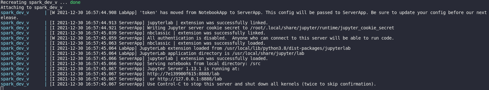
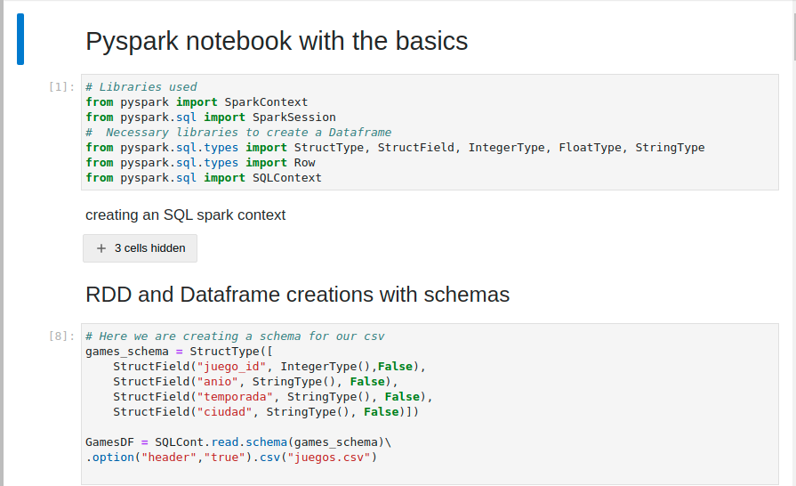

# Docker and pyspark

_This is a simple project to setup pyspark with docker_


### Pre-requisites  📋

_For this project you need to have docker and docker compose installed on your computer._
_You can download and install docker in this link: https://www.digitalocean.com/community/tutorials/how-to-install-and-use-docker-on-ubuntu-20-04-es_

### Setup 🔧

_In this case our docker file  and docker-compose is ready, the only thing we have to do is to build the container_

_We build the container_

```
docker-compose up --build spark_dev_v
```

_If everything went well we should get a message in console_




## Running the tests ⚙️

_in the project we have 3 notebooks where we do some basic operations in the dataframes and rdds_





## Built with 🛠️


* [Docker](https://docs.docker.com/get-docker/) - 🐋

* [Python](https://docs.python.org/3/) - 🐍


## Expressions of Gratitude 🎁

* Tell others about this project 📢
* Invite a beer 🍺 or a coffee ☕ . 
* Say thank you publicly 🤓.
* etc.
